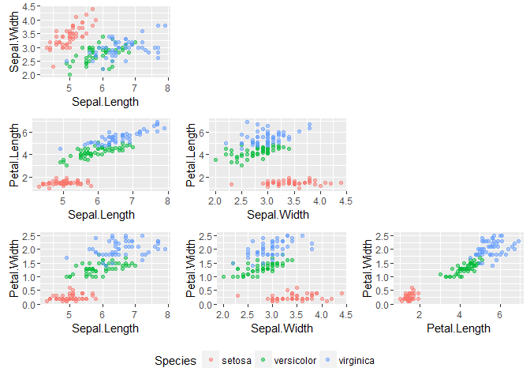
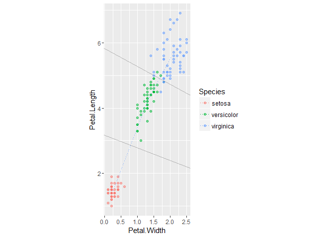

Experimenting with R Markdown. We'll use the iris dataset:

``` r
## Read in and summarize the data
data(iris)
str(iris)
```

    ## 'data.frame':    150 obs. of  5 variables:
    ##  $ Sepal.Length: num  5.1 4.9 4.7 4.6 5 5.4 4.6 5 4.4 4.9 ...
    ##  $ Sepal.Width : num  3.5 3 3.2 3.1 3.6 3.9 3.4 3.4 2.9 3.1 ...
    ##  $ Petal.Length: num  1.4 1.4 1.3 1.5 1.4 1.7 1.4 1.5 1.4 1.5 ...
    ##  $ Petal.Width : num  0.2 0.2 0.2 0.2 0.2 0.4 0.3 0.2 0.2 0.1 ...
    ##  $ Species     : Factor w/ 3 levels "setosa","versicolor",..: 1 1 1 1 1 1 1 1 1 1 ...

``` r
summary(iris)
```

    ##   Sepal.Length    Sepal.Width     Petal.Length    Petal.Width   
    ##  Min.   :4.300   Min.   :2.000   Min.   :1.000   Min.   :0.100  
    ##  1st Qu.:5.100   1st Qu.:2.800   1st Qu.:1.600   1st Qu.:0.300  
    ##  Median :5.800   Median :3.000   Median :4.350   Median :1.300  
    ##  Mean   :5.843   Mean   :3.057   Mean   :3.758   Mean   :1.199  
    ##  3rd Qu.:6.400   3rd Qu.:3.300   3rd Qu.:5.100   3rd Qu.:1.800  
    ##  Max.   :7.900   Max.   :4.400   Max.   :6.900   Max.   :2.500  
    ##        Species  
    ##  setosa    :50  
    ##  versicolor:50  
    ##  virginica :50  
    ##                 
    ##                 
    ## 

We see that there are 150 total observations of anatomical characteristics of three iris species. A visualization using `ggplot2`:

<!-- -->

Observations:

-   The *setosa* species is not like the others; it can be distinguished just on the basis of petal size
-   It doesn't look like *versicolor* and *virginica* can be completely separated

Try the linear discriminant as implemented in `MASS`.

\[h(x)=\operatorname{argmax}\Big[\hat{\mu}_{c}^{T}\Sigma^{-1}x-\frac{1}{2}\hat{\mu}_{c}^{T}\hat\Sigma^{-1}{\mu}_{c}\Big]\]

``` r
library(MASS)
(iris.lda <- lda(Species ~ ., data=iris)) #enclosing in () makes R print the output
```

    ## Call:
    ## lda(Species ~ ., data = iris)
    ## 
    ## Prior probabilities of groups:
    ##     setosa versicolor  virginica 
    ##  0.3333333  0.3333333  0.3333333 
    ## 
    ## Group means:
    ##            Sepal.Length Sepal.Width Petal.Length Petal.Width
    ## setosa            5.006       3.428        1.462       0.246
    ## versicolor        5.936       2.770        4.260       1.326
    ## virginica         6.588       2.974        5.552       2.026
    ## 
    ## Coefficients of linear discriminants:
    ##                     LD1         LD2
    ## Sepal.Length  0.8293776  0.02410215
    ## Sepal.Width   1.5344731  2.16452123
    ## Petal.Length -2.2012117 -0.93192121
    ## Petal.Width  -2.8104603  2.83918785
    ## 
    ## Proportion of trace:
    ##    LD1    LD2 
    ## 0.9912 0.0088

``` r
# Confusion matrix
table(Predicted=predict(iris.lda, iris[,1:4])$class,
      Actual=iris$Species)
```

    ##             Actual
    ## Predicted    setosa versicolor virginica
    ##   setosa         50          0         0
    ##   versicolor      0         48         1
    ##   virginica       0          2        49

Not half bad. But from the scatter plots we can get away with just petal length and width:

``` r
(iris.lda <- lda(Species ~ Petal.Length + Petal.Width, data=iris))
```

    ## Call:
    ## lda(Species ~ Petal.Length + Petal.Width, data = iris)
    ## 
    ## Prior probabilities of groups:
    ##     setosa versicolor  virginica 
    ##  0.3333333  0.3333333  0.3333333 
    ## 
    ## Group means:
    ##            Petal.Length Petal.Width
    ## setosa            1.462       0.246
    ## versicolor        4.260       1.326
    ## virginica         5.552       2.026
    ## 
    ## Coefficients of linear discriminants:
    ##                   LD1       LD2
    ## Petal.Length 1.544371 -2.161222
    ## Petal.Width  2.402394  5.042599
    ## 
    ## Proportion of trace:
    ##    LD1    LD2 
    ## 0.9947 0.0053

``` r
# Confusion matrix
table(Predicted=predict(iris.lda, iris[,1:4])$class,
      Actual=iris$Species)
```

    ##             Actual
    ## Predicted    setosa versicolor virginica
    ##   setosa         50          0         0
    ##   versicolor      0         48         4
    ##   virginica       0          2        46

Not quite as clean, but cutting in half the number of features to be measured is (probably?) a win. Let's visualize the (approximate) decision boundaries:

<!-- -->

The darker points indicate overplotting, so the visual count of errors does line up with the confusion matrix above.

To actually show the actual boundaries I need to account for the relative covariances of the classes; not sure how to grab this from the model object but it can be done by hand.
